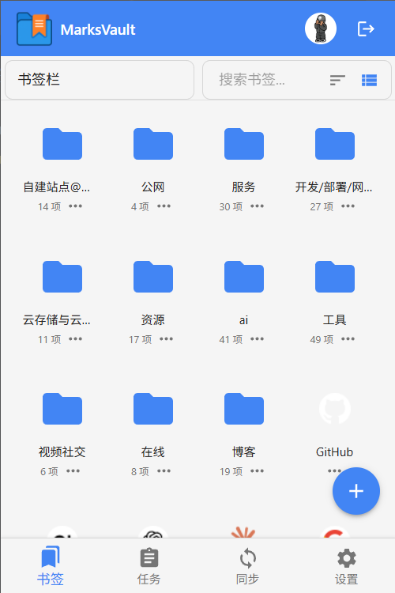
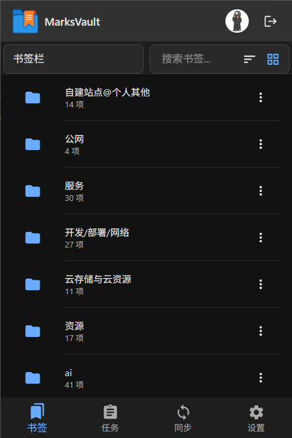
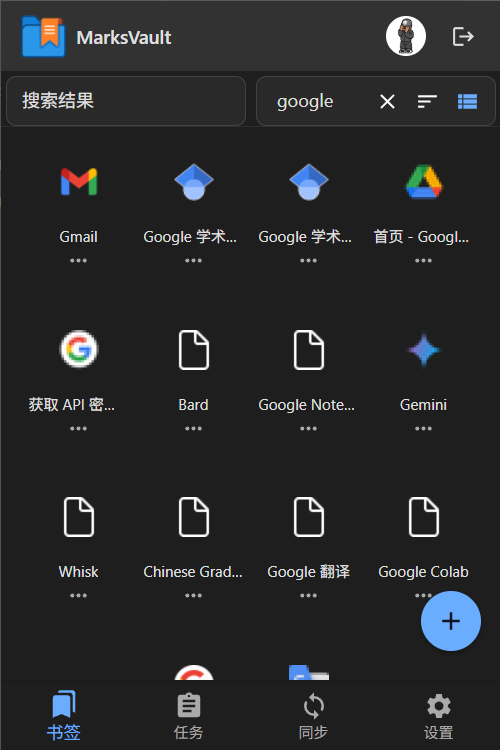
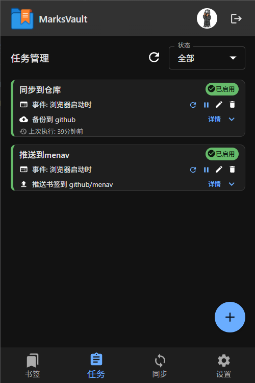
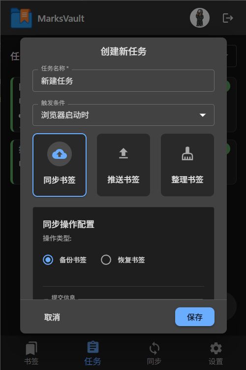
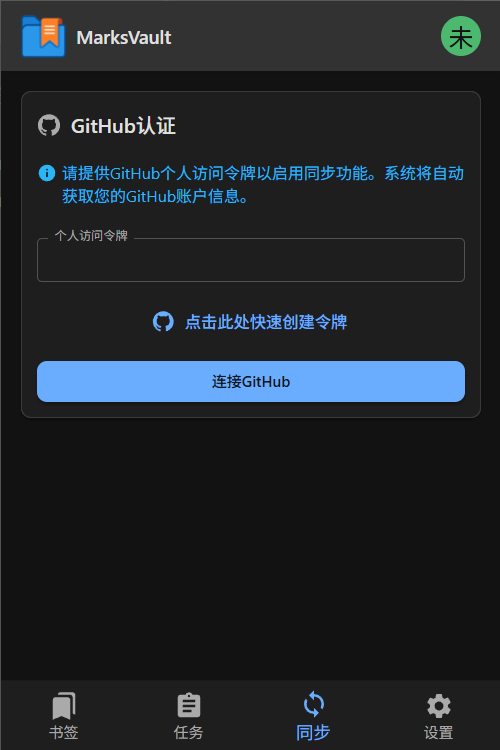
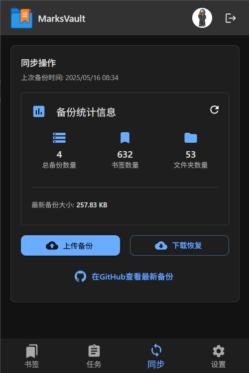
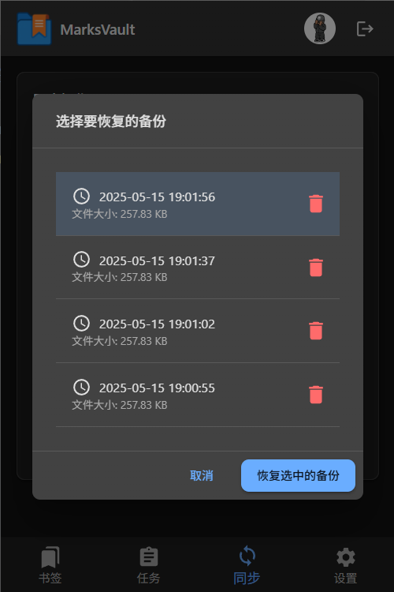
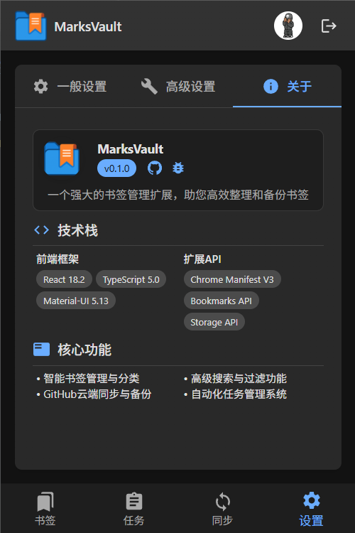

<div align="center">
  
  <h1>MarksVault - 书签保险箱</h1>
  <p>
    一个强大的浏览器扩展，用于智能管理、整理和安全备份您的书签数据
    <br />
    <i>让您的书签管理变得简单、高效、安全</i>
  </p>
</div>

[](https://www.gnu.org/licenses/agpl-3.0.html)
[](https://github.com/rbetree/MarksVault/stargazers)

>MarksVault 是为现代浏览器设计的高级书签管理扩展。它旨在解决浏览器原生书签功能的局限性，为用户提供更强大、更灵活的书签管理体验。通过将书签数据安全地存储在用户自己的GitHub私有仓库中，确保您的数据安全且完全受您控制。

## 📑 目录

- [UI预览](#ui预览)
- [技术栈](#技术栈)
- [功能](#功能)
- [项目结构](#项目结构)
- [安装指南](#安装指南)
- [具体使用](#具体使用)
- [Star-Histor](#Star-History)

## 👀 UI预览

<div align="center">
  <table>
    <tr>
      <td align="center">
        
        <p><i>明亮主题</i></p>
      </td>
      <td align="center">
        
        <p><i>暗黑主题</i></p>
      </td>
    </tr>
  </table>
</div>

<details>
<summary>点击展开查看详细界面预览</summary>

### 书签界面
<div align="center">
  <table>
    <tr>
      <td align="center">
        
        <p><i>列表视图</i></p>
      </td>
      <td align="center">
        
        <p><i>网格视图</i></p>
      </td>
      <td align="center">
        
        <p><i>书签搜索</i></p>
      </td>
    </tr>
  </table>
</div>

### 任务界面
<div align="center">
  <table>
    <tr>
      <td align="center">
        
        <p><i>任务卡片列表</i></p>
      </td>
      <td align="center">
        
        <p><i>任务卡片展开</i></p>
      </td>
      <td align="center">
        
        <p><i>任务创建</i></p>
      </td>
    </tr>
  </table>
</div>

### 同步界面
<div align="center">
  <table>
    <tr>
      <td align="center">
        
        <p><i>GitHub连接</i></p>
      </td>
      <td align="center">
        
        <p><i>连接后备份统计</i></p>
      </td>
      <td align="center">
        
        <p><i>下载恢复</i></p>
      </td>
    </tr>
  </table>
</div>

### 系统界面
<div align="center">
  <table>
    <tr>
      <td align="center">
        
        <p><i>外观设置</i></p>
      </td>
      <td align="center">
        
        <p><i>高级设置</i></p>
      </td>
      <td align="center">
        
        <p><i>关于信息</i></p>
      </td>
    </tr>
  </table>
</div>
</details>

## 🔧 技术栈

| 分类 | 核心技术 |
|------|---------|
| **前端核心** | React 18.2.0, TypeScript 5.0.4, Material-UI(MUI) 5.13.0 |
| **扩展APIs** | Chrome Manifest V3, Bookmarks API, Storage API, Tabs API, Runtime API |
| **状态管理** | React Context API + Hooks |
| **外部集成** | GitHub API (仓库操作与内容管理) |
| **构建与测试** | WXT（Vite）, ESLint 8.40.0, Jest 29.5.0 |
| **项目结构** | 功能模块化设计, Service Worker后台, React弹出界面 |

## 🚀 功能

### 📚 书签管理
- **书签列表与网格** - 支持列表和网格两种显示模式
- **文件夹管理** - 创建和管理书签文件夹
- **拖拽排序** - 直观地重新排列您的书签
- **基础编辑** - 支持书签基本信息编辑

### 🔄 云端同步与备份
- **GitHub集成** - 使用您自己的GitHub私有仓库安全存储书签
- **手动同步** - 支持手动上传备份和下载恢复
- **推送书签** - 支持将书签推送到指定GitHub仓库
- **项目集成** - 与[menav](https://github.com/rbetree/menav)项目集成

>[menav](https://github.com/rbetree/menav)是一个使用github pages托管的个人导航站，欢迎fork使用

>与本项目集成，可自动化上传书签到[menav](https://github.com/rbetree/menav)项目，并自动构建书签页

### ⏱️ 自动化任务系统
- **任务管理** - 创建、编辑、删除和启用/禁用自定义任务
- **基于事件的触发** - 设置任务触发条件
- **操作配置** - 自定义每个任务的具体操作和参数
- **执行状态跟踪** - 跟踪任务执行状态
- **选择性推送** - 手动选择书签推送到 GitHub 仓库，支持与 [menav](https://github.com/rbetree/menav) 集成

## 📁 项目结构

```
public/                   # 静态资源（原样拷贝到输出目录）
└── assets/               # 图标、截图等资源

src/                      # 源代码（WXT srcDir）
├── entrypoints/          # WXT 入口（自动生成 manifest）
│   ├── background.ts     # 后台 Service Worker 入口（MV3）
│   ├── popup/            # Popup 页面（输出为 popup.html）
│   │   ├── index.html
│   │   └── main.tsx
│   ├── options/          # Options 页面（输出为 options.html）
│   │   ├── index.html
│   │   └── main.tsx
│   └── taskconfig/       # Unlisted Page（输出为 taskconfig.html）
│       ├── index.html
│       └── main.tsx
├── popup/                # Popup 业务 UI（React）
│   ├── components/       # React组件
│   │   ├── BookmarksView/# 书签管理视图组件
│   │   ├── TasksView/    # 任务管理视图组件
│   │   ├── SyncView/     # 同步设置视图组件
│   │   ├── SettingsView/ # 系统设置视图组件
│   │   └── shared/       # 共享组件
│   │       ├── Header.tsx        # 顶部栏组件
│   │       ├── BottomNavigation.tsx # 底部导航组件
│   │       ├── Toast.tsx         # 通知提示组件
│   │       └── LoadingIndicator.tsx # 加载指示器
│   └── contexts/         # 主题/上下文等
├── taskconfig/           # 任务配置/执行页面（React）
│   └── components/
├── services/             # 服务层
├── types/                # TypeScript类型定义
└── utils/                # 工具函数

wxt.config.ts             # WXT 配置（manifest/构建）
```

## 📥 安装指南

### 直接安装
1. 前往 [Releases](https://github.com/rbetree/MarksVault/releases) 页面，下载最新版本的扩展文件：
   - `marksvault-<version>-chrome.zip` - Chrome / Chromium
   - `marksvault-<version>-edge.zip` - Microsoft Edge
   - `marksvault-<version>-firefox.zip` - Firefox
   - （Firefox 上架 AMO 时，可能还会附带 `marksvault-<version>-sources.zip` 用于源码提交）

2. 使用ZIP文件安装:
   - 解压下载的 `.zip` 文件到本地文件夹
   - 打开 Chrome 浏览器，访问 `chrome://extensions/`
   - 启用右上角的"开发者模式"
   - 点击"加载已解压的扩展程序"
   - 选择刚刚解压的文件夹

### 开发者安装
1. 克隆MarksVault仓库到本地环境
   ```bash
   git clone https://github.com/rbetree/MarksVault.git
   cd MarksVault
   ```
2. 安装项目依赖
   ```bash
   npm install
   ```
3. 构建扩展
   ```bash
   npm run build
   ```
4. 在Chrome浏览器中加载扩展:
   - 打开 `chrome://extensions/`
   - 启用"开发者模式"
   - 点击"加载已解压的扩展程序"
   - 选择项目中的`.output/chrome-mv3`目录

> Edge：选择 `.output/edge-mv3`；Firefox：在 `about:debugging#/runtime/this-firefox` 中加载 `.output/firefox-mv2/manifest.json`。


## 📝 具体使用

### 1. 初始设置

1. **安装完成后**:
   - 在Chrome浏览器右上角的扩展图标区域找到MarksVault图标并点击
   - 扩展弹出窗口会显示，底部有四个导航选项：书签、任务、同步和设置
   - 首次打开时会自动进入书签页面

### 2. GitHub同步设置

1. **获取GitHub Token**:
   - 打开同步页，快速创建令牌
   - 在令牌创建页，直接创建即可（必要权限将自动勾选）
   - 生成令牌后，立即复制它（页面刷新后将不再显示）

2. **配置GitHub凭据**:
   - 将复制的令牌粘贴到同步页GitHub Token输入框中
   - 点击"连接GitHub"按钮
   - 如配置成功，页面会显示您的备份统计信息

3. **配置备份仓库**:
   - 默认创建"marksvault-backups"私有仓库用于书签备份

### 3. 愉快使用

## Star-History

[](https://www.star-history.com/#rbetree/MarksVault&Date)
